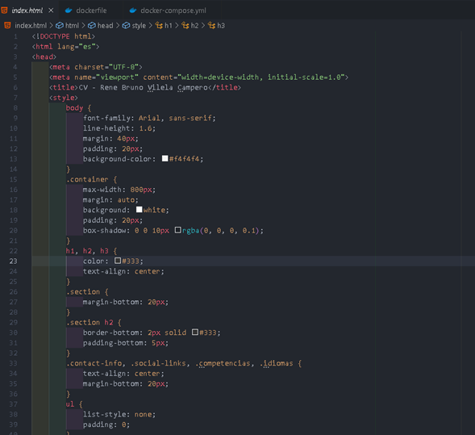
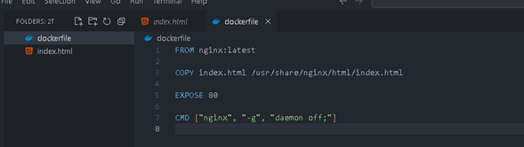
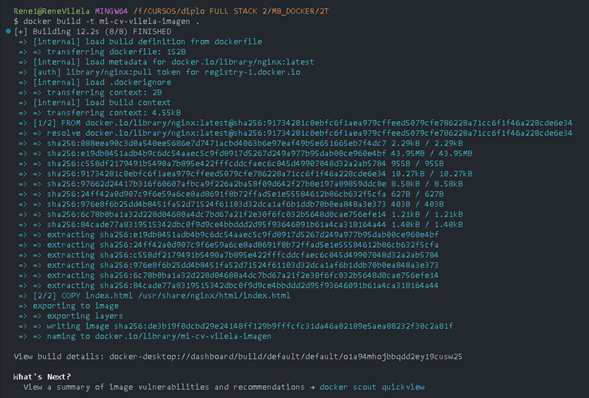
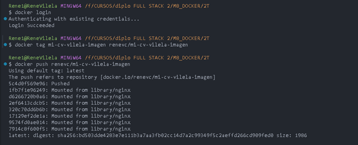
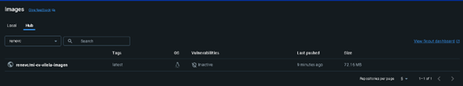
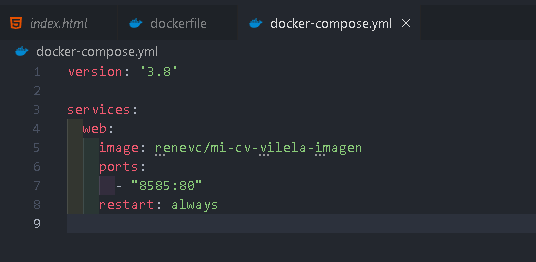
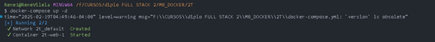
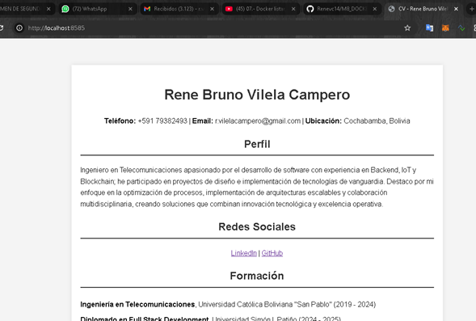

## DOCUMENTACIÓN DE LA PRUEBA
Se realiza un HTML básico con la información de mi CV.

### 2. Imagen Docker
Ejecutar el siguiente comando en la terminal:
```sh
docker build -t mi-cv-vilela-imagen .
```


### 3. Docker Hub
```sh
docker tag mi-cv-vilela-imagen <tu-usuario-docker>/mi-cv-vilela-imagen
docker push <tu-usuario-docker>/mi-cv-vilela-imagen
```


### 4. Docker Compose


### 5. Despliegue
```sh
docker-compose up -d
```
La página web estará disponible en: [http://localhost:8585](http://localhost:8585)



### Verificar el Estado del Contenedor
```sh
docker ps
```

### Detener el Servicio
```sh
docker-compose down
```

## Agregar Imágenes al README
Si deseas agregar imágenes al `README.md`, colócalas en una carpeta llamada `images` y usa la siguiente sintaxis:

```markdown

```

Ejemplo:


## Notas
- Si realizas cambios en `index.html`, recuerda reconstruir y volver a subir la imagen a Docker Hub.
- Puedes ver los logs con:
```sh
docker logs <ID_DEL_CONTENEDOR>
```

 🚀 Proyecto listo para ser ejecutado con Docker y Docker Compose.